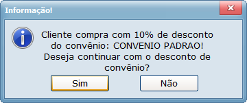
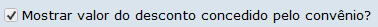
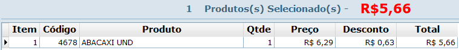
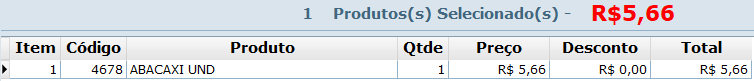

# Módulo DAV

## Pré Vendas
---
### 1. Preços:
### 1.1. Preço do Cliente
No Retaguarda, na tela de Cadastro de Clientes na aba Financeiro, é possível definir o preço utilizado nas vendas para aquele cliente (venda, custo, promocional ou consignado), dessa forma, ao realizar alguma venda no sistema para aquele cliente será considerado o preço configurado para ele.

Exemplo: O preço configurado para o cliente 1 é o preço de custo. Ao vender o produto x para esse cliente no DAV será carregado e vendido o produto x pelo preço de custo.

Exceções:
* O produto é vendido como balança. Nesse caso será considerado o preço que o produto exporta.
* O tipo de preço no DAV está diferente de Normal. Quando se utiliza vários preços no DAV, quando se insere um preço diferente do Normal, por exemplo preço de venda, mesmo se o cliente estiver configurado para vender a preço de custo, será carregado e vendido a preço de venda.
---
### 2. Convênio Cliente
No cadastro de clientes é possível definir um convênio que concede um desconto de acordo com o configurado no convênio em: cadastros -> clientes -> convênio. Dessa forma quando é realizada uma venda, por exemplo, no DAV, quando se insere o cliente e confirma que deseja vender com desconto do convênio será dado o desconto do convênio naquele produto.

Ao se inserir um item aplicando desconto no convênio é possível que seja inserido o produto de duas formas, mostrando o valor do desconto ou já descontando o valor diretamente no item. Isso é definido de acordo com a configuração abaixo, localizada em: Retaguarda -> Sistema -> Configurações -> Estoque -> Orçamento /Pré-venda -> Impressão.

Quando marcada essa configuração, ao se inserir o item no DAV é exibido da seguinte forma, separando o valor do produto do desconto do convênio.

 Dessa forma, quando se consolida o orçamento o valor do desconto é informado separado na venda. Ficando no exemplo acima como valor da venda R$ 5.66, o valor total dos itens R$ 6.29 e o desconto R$ 0.63.

Já quando a configuração está desmarcada, o valor do desconto já é removido automaticamente do preço do produto, dessa forma o preço do produto já é considerado como sendo o preço do produto menos o desconto do convênio.

Dessa forma, quando se consolida o orçamento o valor do desconto não é informado separado na venda. Ficando no exemplo acima como valor da venda R$ 5.66, o valor total dos itens R$ 5.66 e o desconto R$ 0.00.